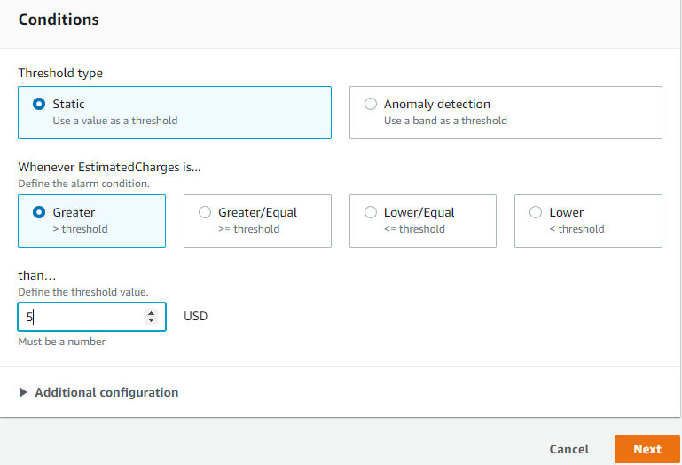

# AMAZON WEB SERVICES (AWS)

Amazon Web Services je podle definice Amazonu „bezpečná výpočetní platforma, která poskytuje výpočetní výkon, databáze, propojování mezi sítěmi, a disky pro uložení dat.“

AWS je celosvětově využívaná veřejná cloudová služba nejen v zahraničí, ale i u nás, v České republice. Přední zákazníci u nás jsou například Innogy, social bakers, sli.do v zahraničí

AWS nabízí až 26 regionů _**(vložit obrázek)**_, kdy každý region je nezávislý a je propojen vysokorychlostní optickými kabely. Nabízí více než 158 Edge locations , aby poskytly co nejnižší latenci, 84 Availability zones  ve více než 250 zemích světa, kde v každé zóně má 2 a více datacenter. Aktuální informace na: https://aws.amazon.com/about-aws/global-infrastructure/

## Placení

Amazon Web Services využívá, stejně jako ostatní cloudy, pay-as-you-go model, známý také jako Pay Per Usage nebo Pay-As-You-Use. Tento model je založen na předplatném a spotřebě. Platí se za délku používání služby, zdrojů (HW – RAM, CPU, GPU atd.), množství uložených dat na disku, a odchozí přenos dat.

## Zakládání a správa účtu

Začneme tím, že přejdeme na webovou stránku https://aws.amazon.com/ a klikneme v pravém horním rohu na  „Create an AWS Account“. Pokud jsme se již někdy přihlásili, vypíše se místo toho „Sign In to the Console“.

Zadáme informace a klikneme na „Continue“. Pozor! Pokud zadáme špatné informace, tedy emailovou adresu, tak se nebudeme moci k našemu AWS účtu dostat.

Zvolíme „Personal“ účet a poté se nás zeptá na nějaké naše informace, které vyplníme. A pak už jen „Create Account and Continue“. Poté stačit ověřit email a potvrdit účet v emailové schránce. Vytvořili jsme si free účet, kde máme 750 hodin služeb v provozu zdarma. Pro naše účely je ale dostačující.

Přejdeme do nastavení našeho účtu a vložíme informace o naší kreditní kartě, které jsou k využívání služeb potřeba. Bez předem dané platební metody nám Amazon neumožní využívání služeb. Na stránce „Payment Information“, v levém menu, přidáme naši kreditní kartu, ze které strhnou $1 USD (americký dolar) k ověření, zda účet existuje. Peníze se vám vrátí během tří až pěti pracovních dnů.

Poznámka: Částka, která se strhává se může lišit v závislosti na kurzu měn.

## Ověřovací metoda 

### Doplňkové zabezpečení MFA (Multi Factor Authentication) 
Doplňkové zabezpečení MFA, neboli Multi Factor Authentication je další vrstvou zabezpečení účtu pro hackerům. Využívá mobilního telefonu s kódem, který se mění.

1. Přejdeme do služby IAM (Identity and Access Management).
2. Klikneme na v hlavním panelu na `Add MFA Yourself` nebo v `Users` klikneme na uživatele.

3. Přejdeme do skupiny `Security Credentials` -> `Assigned MFA device` klikneme na „Manage.“
4. Vybereme metodu „Virtual MFA device“ a dáme „Continue.“
5. Nainstalujeme aplikaci GOogle Authenticator či jinou alternativu: https://play.google.com/store/apps/details?id=com.google.android.apps.authenticator2&hl=cs&gl=US
6. Klikněte na QR kód a oskenujte ho pomocí aplikace `Scan QR Code`
7. Poté stačí napsat 2 kódy (MFA code 1, 2), které za určitou dobu proběhnou za sebou a kliknout na Assign MFA

### Billing alarm

Jedna z velice důležitých věcí, na kterou bychom neměli zapomenout je hlídat stav našeho účtu a kolik peněz si Amazon účtuje. Tuto funkci splňuje služba, která je zdarma a je v nastavení účtu. V rámci kurzu, který má většinu našich služeb zdarma po dobu provozu 750 hodin se nemusíme obávat, že by nám Amazon strhával peníze. K tomuto účelu je tu Billing alarm, který nás upozorní, pokud překročíme hranici kterou si nastavíme.

V horní liště na vyhledávání napíšeme „Billing“, poté přejdeme do nabídky „Billing preferences“. Jsou zde 3 možnosti, ale my budeme využívat poslední jen poslední 2. První pošle fakturu emailem, obvykle během tří dnů na začátku měsíce. Druhá nám bude posílat upozornění na email, který zadáme a třetí bude monitorovat průběh využívání služeb a jejich vyúčtování (nejde deaktivovat). Klikneme na „Save preferences“. Další nastavení Billing alarmu se jich nachází CloudWatch službě.

- Ukázka z billing alarmu (cena za provozování služby Route53 v období 1.2 až 28.2. 2022)

### Služba CloudWatch **(přidat obrázky)**

V horní nabídce „Services“ pod kategorií „Management & Governance“ se nachází služba CloudWatch, který, který nám monitoruje dobu využívání služeb v provozu a využité zdroje (CPU, RAM a další). K tomuto účelu využívá i grafy, na kterých je vše přehledně vidět.

Jedná se o jednu z regionálních služeb čili funguje na úrovni regionu, kde ji nastavíme. V pravém horním rohu musíme vždy **vybrat US East (N. Virginia), co se týče placení.** V levé nabídce potom zvolíme v pořadí z leva do prava: Alarms – Create alarm – Select metric – Billing – Total Estimated Charge – Select metric.

Dole máme Treshold type, „Whenever Estimated Charges is… a than… do posledního políčka vložíme částku v amerických dolarech. Upozorní nás, že pokud překročíme částku např. $5, tak dostaneme notifikaci na náš email (služba Billing Alarm). Klikneme na „next“. Použijeme „Create new topic“ a libovolně si ho pojmenujete, např. „Billing_Notification“. Potom se můžeme podívat do SNS Console a tam už vidíme všechny informace.

## AWS Identity and Access Management Service (IAM)

### Vytváření skupiny

Přihlásili jsme se pod root  účtem, který má všechna práva k účtu. Kdyby se nám sem ale někdo cizí dostal, mohl by ukrást naše citlivé údaje. K tomu potřebujeme vytvořit uživatele, pod kterým se budeme přihlašovat a zároveň nebude mít přístup k citlivým údajům. A taky si zde usnadníme přihlašování.

Začneme vytvořením skupiny, které přiřadíme práva a následně uděláme uživatele využijeme IAM. Přejdeme d Services, poté Security, v kategorii „Identity & Compliance je služba „IAM“.

Přejdeme do pravého panelu a v „User Groups“ vytvoříme naši skupinu „Create Group“. Pojmenujeme si ji například „Admins“. Dole máme pravidla, tedy oprávnění pro skupiny (Permissions policies). Do vyhledávacího pole napíšeme „AdministratorAccess“, které zaškrtneme. Všechna práva jsou psána v JSONu . V obrázku níže je vidět jednoduchý skript, ve kterém máme vše hlavní zpřístupněno.

### Změna ID na jméno

Přihlašování do konzole pro námi vytvořeného uživatele za pomocí identifikačního čísla nebude nejjednodušší. Změníme ho na jméno. V IAM službě se toto dá nastavit. Využijeme Account Allias funkce, která je ve výchozím nastavení pod naším ID účtu (Account ID) na něco víc „user friendly“. Pojmenujeme si ho a uložíme změny.

### Vytváření uživatele

Přejdeme opět do IAM služby a v pravé liště klikneme na „Users“, poté „Add User“. V „Select AWS access type“. Zvolíme „Password – AWS Management Console Access“. Poslední možnost odklikneme, pokud nechceme znovu vytvářet heslo a nechceme, aby uživatel dostal práva si znovu vytvořit heslo. Klikneme na „Next“. Zde můžeme uživatelům přiřazovat práva, stejně jak u skupiny. Zatrhneme skupinu, kterou jsme si vytvořili. Práva je lepší přiřazovat skupině, necháme výchozí nastavení. Další 2 způsoby jsou popsané níže.

Copy permissions from existing user – zkopíruje práva od jiného uživatele.
Attach existing policies directly - tato možnost není doporučována, protože snazším způsobem je přiřazovat práva skupině, ke které je uživatel přiřazen.

V dalším okénku jsou tagy, které pro nás nejsou důležité. Tags - Tyto štítky nejsou důležité. Ovšem, pokud chcete dále uživateli upravovat oprávnění, nebo k čemu má mít přístup, tak se dají nastavit. Ty ale pro nás nejsou důležité.

Po kliknutí na „Create User“ máme našeho uživatele vytvořeného. A pomocí odkazu, který je v zeleném rámečku se můžeme přihlásit. V první kolonce napíšeme naše přístupové jméno/ID do konzole, proto jsme si ho měnili na jméno, jelikož je praktičtější. „IAM user name“ je naše jméno, podjkterým jsme si vytvořili nového uživatele a zařadili do skupiny admins pod naším root účtem. A nakonec heslo uživatele.

Pod naším uživatelem, jako k jediné informaci, ke které nemůžeme přistoupit je „billing“, tedy fakturační údaje (osobní údaje + kreditní karta).

## Virtuální stroj na AWS

### EC2 Amazon Elastic Compute Cloud

Je virtuální server, na kterém běží instance služeb. Např. v našem cvičení vytvoření instance virtuálního stroje na bázi Linuxu (distribuce od Amazonu). Ve výchozím nastavení používá u všech služeb veřejnou IP adresu, která se po každém spuštění služby **mění**.

Zde lze podotknout, že máme privátní IP adresu (IPv4, nebo IPv6, podle toho, kterou nám AWS přiřadí.) Pokud bychom chtěli veřejnou (dynamickou)/Elastic IP adresu, za ní si musíme připlatit.

**Veřejná IP adresa** = zmizí, pokud je naše instance (např. webové aplikaci, virtuálního stroje atd.) vymazána, při vytvoření nové instance se změní, proto dynamická. Používá se ve veřejné podsíti, přidružená k privátní adrese instance. Nemůže být přesouvána z instance na instanci. Př.: Používám virtuální stroj A (instance 1), chci adresu použít i na mojí druhou instanci, virtuální stroj B, to ale nejde.

**Privátní IP adresa** = používá ve veřejných a soukromých podsítí a uloží se, pokud zastavíme instanci.

**Elastická IP adresa** = je statická veřejná IP adresa a platí se za ní, pokud není využívána a zároveň asociována s instancí. Je spojená se soukromou IP adresou instance a může se pohybovat mezi instancemi. Vložit obrázek

## Navigace:
  - [Cloudové služby obecně](Cloudove_sluzby_obecne.md)
  - [Amazon Web Services - Základní nastavení účtu](AWS_nastaveni.md)
  - [Virtuální stroj v AWS](AWS_navod_VM.md)
  - [Statický web v S3 Bucket](AWS_navod_static_website.md)
  - [Návod zprovoznění CMS Wordpress](AWS_navod_wordpress.md)
  - [Dokumentace](docs/Dokumentace.doc)