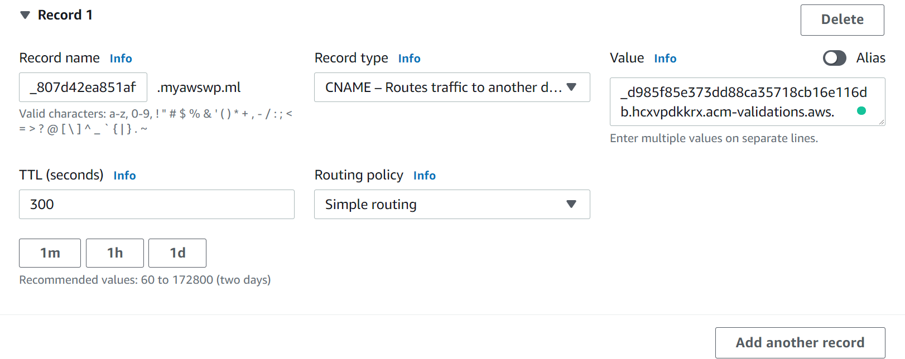
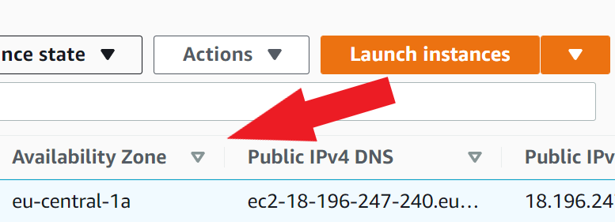

## 2.7 Web postavený na frameworku s PHP - zprovoznění (CI4)

Myslím si, že každý, kdo dělá web, chce použít vlastní framework a mít nad webem kontrolu. Lightsail je taková jednodušší služba, ale nemáme nad webem plnou kontrolu. V tomto případě využijeme EC2, kde si všechno nastavíme, budeme také pracovat s CLI (Command Line Interface).

### 2.7.1 EC2 – vytvoření instance Linuxu

Vytvoříme si novou instanci EC2. V horní vyhledávací liště napíšeme „EC2“. Zde potom klikneme na „Launch instances“. Projistotu zaškrtneme opět „Free tier only“ a první linuxovou distribuci.


Čekají nás další kroky, které přeskočíme, kromě „Configure security group“. Pro naše testování nám postačí.

V konfiguraci bezpečnostních skupin můžeme buď vybrat naši existující, již vytvořenou „Security group“, nebo vytvořit novou.


Potom bychom v ní nastavili tyto nové porty, a to https a https. Viz předchozí kapitola, kde je všechno popsané co a k čemu slouží.

***Vytvoření skupiny***

Vybrali bychom „Create a new security group“ a zde již naklikali HTTPS a http přesně tak, jak je na obrázku a libovolně si ji pojmenovali.


Na konci nám stačí zkontrolovat, jestli máme vše vyplněné a „Launch.“ Pokud se nás zeptá na vytvoření nového klíče či použít existující, nechám na vás.

**Nesmíme zapomenout si naši instanci pojmenovat**, abychom se vůbec vyznali co na jaké instanci nám běží. V hlavním menu EC2 služby klikneme na ikonku poznámky jak je vyobrazeno na obrázku.


Vysvětlení jak se připojuje k instanci přes PuTTY je vysvětleno v kapitole [Připojení k instanci přes Putty](AWS_navod_VM.md/#2.4.3-Připojení-k-instanci-linuxu-přes-Putty)

Poté se můžeme připojit přes aplikaci PuTTY na náš stroj, kde poté zadáme následující příkazy (K základnímu updatu a upgradu balíčků + apache server):
```
sudo yum update -y
sudo yum install -y httpd.x86_64. / sudo yum install -y httpd 
```

Server spustíme příkazem: 
```
sudo systemctl start httpd.service
sudo sytemctl enable httpd.service 
```
(po každém zapnutí instance se nám rozjede služba apache)

V instancích vyzkoušíme, pokud jestli se nám povedlo rozjet naši instanci. **Změna může nastat i klidně po 30 minutách**. Pokud se povedlo, tak bychom měli mít základní apache stránku.


Předtím, než začneme s instalací MySQL služby, musíme nastavit elastickou IP adresu, jak již z předchozího návodu, musí být připojena k instanci, jinak za ní budeme platit.

V pravém panelu v kategorii „Network & Security“ zvolíme „Elastic IPs.“ Zde klikneme v pravém horním rohu na „Allocate Elastic IP address.“


Po vytvoření opět musíme vybrat naši IP adresu a kliknout na „Actions“ a „Associate Elastic IP address“. Z výběru instancí zvolíme tu, kterou chceme s elastickou IP adresou svázat a zašrkrtneme poslední políčko tak, jak je to na obrázku a kliknem na „Associate.“


Popřípadě mžůeme instalovat všechno v jednom pomocí xampp klienta a potom intuitivně nastavovat databázi přes phpMyAdmin.
Použijeme příkaz ke stáhnutí xampp balíčku:

sudo wget https://www.apachefriends.org/xampp-files/8.1.1/xampp-linux-x64-8.1.1-2-installer.run

poté můžeme udělat soubor spustitelný pomocí:
```
sudo chmod +x xampp-linux-x64-8.1.1-2-installer.run
Instalaci spustíme příkazem:
sudo ./xampp-linux-x64-8.1.1-2-installer.run
```
Vše v instalaci potvrdíme (buď napíšeme y zmáčkneme enter) a vyčkáme dokud nám nenapíše systém, že je vše nainstalované. Po naisntalování můžeme spustit xampp pomocí příkazu:

`sudo /opt/lampp/lampp start`


Když přejdeme na phpMyAdmin, tak se nám zobrazí strának s chybovou hláškou, kterou spravíme v httpd-xampp.conf.


Tento soubor se nachází ve adresáři extra. Celá celá k souboru je /opt/lampp/etc/extra/httpd-xampp.conf. K editaci si ho můžeme zkopírovat do domovské složky a pak otevřít skrze WinSCP, abychom ho mohli editovat, nebo využít editoru vi/nano, nezapomeňte ho spustit příkazem sudo.
V souboru „httpd-xampp.conf“ označíme část:

„Require local“

**a vložíme místo této části text:**

```
AllowOverride AuthConfig Limit
Order allow,deny
Allow from all
Require all granted
```

Poté stačí restartovat pomocí příkazu: `sudo /opt/lampp/lampp restart`.
V dalším kroku nastavíme heslo k phpMyAdmin.
Příkaz: `sudo /opt/lampp/xampp security`

Poté se stačí řídit příkazy, ale jak se dostanete k otázce:

**"The FTP password for user ‚daemon‘ is still set to ‚xampp‘."**
Napište `no`.

Výchozí uživatel je vždy: root. Heslo je takové, jaké jste si zvolili.
Poté můžeme nastavit databázi intuitivně přes phpmyadmina:


Přes WinSCP můžeme nahrát náš web do domovského adresáře a přesunout ho přes příkaz do /opt/lampp/htdocs složky:

`sudo mv -R skola-mapy /opt/lampp/htdocs`

Poté musíme přidat oprávnění (v mém případě složka s webem skola-mapy)
Pokud jsme neměnili nic v nastavení, hlavní httpd je „daemon“, jinak bychom museli napsat:
ps aux | grep httpd
sudo chown -R daemon /opt/lampp/htdocs/skola-mapy
Vše je teď hotové, stačí nám už jen spustit web.


### 2.7.2 Certificate Manager (Zajištění SSL certifikátu)
Chceme-li mít naše připojení zabezpečené a šifrované, využijeme služby Certificate Manager, který nám umožní vytvořit SSL certifikát pro naši webovou stránku, který zabezpečuje připojení mezi transportní a aplikační vrstvou.

Místo adresy „http://www.myawswp.ml“ budeme mít zabezpečenou adresu „https://www.myawswp.ml“, takže náš prohlížeč nebude hlásit, že je připojení nezabezpečené. Zároveň SSL certifikát musí být připojený k jedné službě ať už je to Load balancer, CloudFront či další vhodné.

Předtím, než začneme odkazuji na tutoriál „Doména webové stránky (přes DNS freenom.com),“ kde mám popsanou část se službou Route53 a přístup k webu ať už uživatel napíše adresu s předponou „www,“ nebo bez. Část s vlastní DNS freenom můžeme vynechat, pokud nechceme vlastní doménu. Ale vytvoření „hosted zone.“ je povinné.

My si vybereme Load balancer, který slouží k balancování „dopravy.“ Pokud bude jeden server zatížený, tak Load balancer rozprostře požadavky na server po ostatních vytvořených serverech, ke kterým se dostanu.

Najdeme si službu Certificate Manager. Vybereme „Request a certificate“ a zvolíme „Request a public certificate.“ V „Domain names“ napíšeme naši webovou stránku, pro mě již vytvořená „myawswp.ml“ „www.myawswp.ml,“ jelikož pokud chceme udělat web přístupný pod kterýmkoliv formátem, který uživatel zadá, musíme přidat 2 adresy do certifikátu. V Lightsail toto vše bylo řešeno pouze pár příkazy, v EC2 máme nad tím plnou kontrolu.


V dalším kroku se Amazon musí ujistit, že jsme vlastníky domény. Zvolíme první možnost a dole „request.“ **Stránku nezavírejte!**


Rozklikneme Certificate ID našeho certifikátu a v Domains máme CNAME name a CNAME value record, který přidáme do Route53 -> Hosted zones -> naše doména. Vytvoříme nový „Record Set.“ Vrátíme se zpátky na náš certifikát a zkopírujeme CNAME name, který potom vložíme záznamu, který tvoříme v „Record name.“ **Smažeme na konci naši doménu, kterou již máme vytvořenou**. „Record type“ navolíme CNAME a „Value“ zkopírujeme opět z našeho certifikátu a vložíme a vytvoříme záznam.




Vyčkáme asi kolem 3-5 minut (může trvat i déle, ale 3-5 minut je obvyklá doba, než Amazon vše ověří a vytvoří nám SSL certifikát. Po znovu načtení stránky se nám ve statusu objeví „Issued.“ V další fázi vytvoříme Load Balancer, ke kterému napojíme právě náš SSL certifikát.


***Load-Balancer – připojení certifikátu k instanci Linuxu***
V rámci služby EC2 je load balancer zdarma na který se musí vázat (nebo k jiné službě), ten potřebujeme k SSL certifikátu. 

V konzoli napíšeme „Load Balancer“ a dole v kategorii „Features“ najdeme „Load Balancers“ pro Lightsail. Klineme na „Create load balancer“ a vybereme „Application load balancer.“ Load Balancer si můžeme libovolně pojmenovat.

***Nastavení load balanceru***

**Název** – zvolíme si libovolný název

**Network mapping** - zde musíme vybrat zóny, kde jsme si vytvořili náš web. Zjistíme v hlavním výběru instancí v EC2 službě v „availability Zone.“ Musíme zvolit minimálně 2 zóny.



**Listeners and Routing** – zde přidáme kromě protokolu „http“ i „https.“
-	V „Listeners and Routing klikneme v „http“ protokolu na „Create target group.“ Pokud budeme chtít pouze přesměrovávat na https, **postačí nám vytvořit skupinu pro https s portem 443 místo portu 80.**


**Create target group name**
-	„Target type“ musí být „Instances“
-	„Target group name“ si pojmenujeme jak budeme chtít
-	Dále zde máme výběr instancí k připojení ke skupině, vybereme naši instanci a klikneme „include as pending below“ a vytvoříme skupinu.


Přejdeme zpátky k load balanceru a klikenme v „http listeneru“ na tlačítko „refresh“ a zvolíme nově vytvořenou skupinu.


**Stejný krok musíme opakovat i pro listener https čili vytvořit další skupinu, tentokrát s portem 443 (https).**

**Secure listener settings -> Default SSL Certificate – zde vybereme náš certifikát**


Security groups – vybere skupinu, kde máme nastavené protokoly: https, https
Vytvoříme load balancer. A zkopírujeme „DNS name“. V route53 pod naším webem vytvoříme záznam typu „A record.“ Můžeme smazat A recordy s „www“ i bez www, abychom zde vložili náš nový A record s load balancerem. Přes něj poté budeme přesměrovávat http na https. Vytvoříme stejný record i s „www.“
Route Traffic to – Zde vybereme Alias a v políčkách bude (jak jde za sebou)
1.	Alias to Application and Classic Load Balancer.
2.	Region, ve kterém se nachází náš load balancer
3.	Výběr load balanceru


Jak vypadá route tabulka v Route53 po nasazení SSL certifikátu, nastavení DNS domény, nastavení adresy (funkčnost s „www“ příponou i bez).


***Přesměrování na https***

Stačí přejít do Load Balancers -> Listeners kliknout na http listener a kliknout na „Edit.“ Poté stačí změnit skupinu na tu, kterou jsme si vytvořili pro https protokol.

Ve „View/edit rules“ se dají přidávat libovolná pravidla s „if“ podmínkou.


Ve složce htdocs ve složce /opt/lampp/htdocs/ soubor „index.php“ upravíme podle složky našeho webu.

`Header ('Location: ' ‚.$uri.‘/název složky webu/‘);`