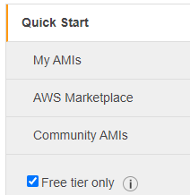
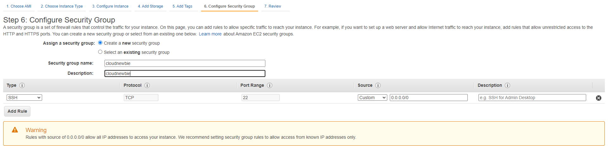
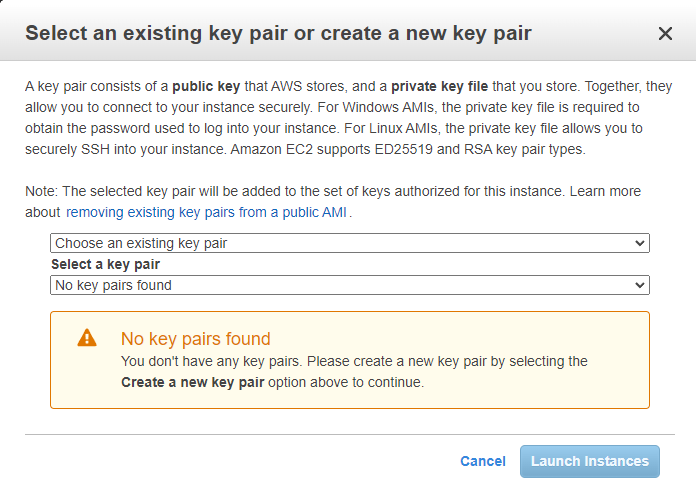
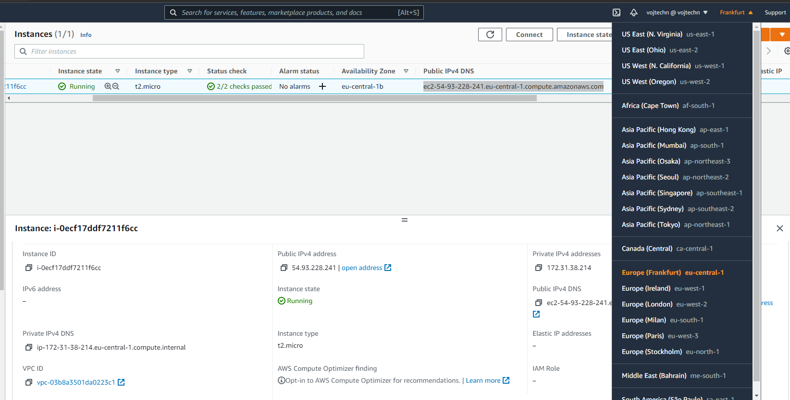
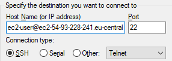

## 2.4	Virtuální stroj na AWS

### 2.4.1 EC2 Amazon Elastic Compute Cloud

Je virtuální server, na kterém běží instance služeb. Např. v našem cvičení vytvoření instance virtuálního stroje na bázi Linuxu (distribuce od Amazonu). Ve výchozím nastavení používá u všech služeb veřejnou IP adresu, která se po každém spuštění služby **mění**.

Zde lze podotknout, že máme privátní IP adresu (IPv4, nebo IPv6, podle toho, kterou nám AWS přiřadí.) Pokud bychom chtěli veřejnou (dynamickou)/Elastic IP adresu, za ní si musíme připlatit.

- **Veřejná IP adresa** = zmizí, pokud je naše instance (např. webové aplikaci, virtuálního stroje atd.) vymazána, při vytvoření nové instance se změní, proto dynamická. Používá se ve veřejné podsíti, přidružená k privátní adrese instance. Nemůže být přesouvána z instance na instanci. Př.: Používám virtuální stroj A (instance 1), chci adresu použít i na mojí druhou instanci, virtuální stroj B, to ale nejde.

- **Privátní IP adresa** = používá ve veřejných a soukromých podsítí a uloží se, pokud zastavíme instanci.

- **Elastická IP adresa** = je statická veřejná IP adresa a platí se za ní, pokud není využívána a zároveň asociována s instancí. Je spojená se soukromou IP adresou instance a může se pohybovat mezi instancemi. Vložit obrázek

### 2.4.2 Vytvoření virtuálního stroje

První co musíme udělat je na úvodní obrazovce přejít do „Services“ déle „Compute“ vybrat EC2, kliknout na „Instances“ a „Launch instances“.

Na obrazovce se nám ukáže spoustu distribucí Linuxu a verzí Windows. K tomu, abychom nezvolili nic placeného **zaškrtneme „Free tier only“**.

Poté se zobrazí detaily konfigurace instance, vedle každého pole je kolečko s písmenem „i“, kde je každé pole vysvětlené. Vše necháme tak jak je a klikneme na „Next“. V nabídce s tagy (Add Tag) si lze označit náš virtuální stroj štítkem. Následuje Configure Security Group, kde nastavujeme port a další nastavení ohledně přístupu do Linuxu.

Type (typ portu SSH, TCP..), Protokol (TCP), Port Range (výchozí 22 pro připojení přes protokol SSH), source (definuje IP adresy, které se můžou připojit na danou instanci našeho virtuálního OS), Description (popis), and (Security Group name), nebo si ho přejmenujeme.

Klikneme na „Next“  a AWS se nás zeptá na vytvoření párů klíčů privátního a veřejného, jelikož máme přístup zabezpečen protokolem SSH.

Klikneme na „Choose an existing key pair“ a vybereme „Create a new key,“ Type ponecháme na RSA a klíč si pojmenujeme jak chceme. Posledním krokem je „Launch instances“ a „View instances.“

### 2.4.3 Připojení k instanci linuxu přes Putty

Odkaz ke stažení programu Putty: https://www.chiark.greenend.org.uk/~sgtatham/putty/latest.html

Po nainstalování spustíme program Puttygen, který nám konvertuje náš stáhnutý SSH klíč k instanci Linuxu. Převede ho z formátu „.pem“ do „.ppk“. Soubor s příponou „.pem“ si otevřeme například v aplikaci Notepad ve Windowsu. Zkopírujeme náš klíč do textového souboru a uložíme do formátu „.txt.“ Poté klikneme v Putty Key Generatoru na Load, kde klíč v „.txt“ formátu najdeme a po kliknutí na „Save private key“ a uložíme.

Druhým krokem je program Putty. Do kolonky „Host Name (or IP address)“ zadáme naši Host Name/IP adresu naší instance, ke které se chceme připojit. Přejdeme na do EC2 služby a klikneme na „Instances“.

Pozor!!! Musíme se přepnout na region, ve kterém jsme si instanci vytvořili. Nejbližší datacentrum se nechází ve Frankfurtu v Německu, kde jsem si instanci Linuxu vytovřil. Poté nás zajímá **Public IPv4 DNS**. V kolonce v Putty musíme zadat „**ec2-@user**“, protože se napojujeme na instanci z uživatelského účtu.

Nezapomeňte, že ve výchozím nastavení máme veřejnou IP adresu, která se po vypnutí a smaže a po jejím opětovném spuštění se změní.

 
Přejdeme v Putty na záložku SSH a zvolíme možnost Auth, kde je „Private Key File Authentication.“ Klikneme na „browse“ a vybereme náš „.ppk“ klíč. Potvrdíme a jsme připojení. První	 krok, který můžeme udělat je aktualizovat všechny balíčky pomocí příkazu: `sudo yum update`

Pomocí příkazu `sudo systemctl poweroff` můžeme náš Linux definitivně vypnout, nebo instanci můžeme jednoduše vypnout v AWS panelu „Instances.“ Klikneme na „Instance state a „Terminate instance.“
