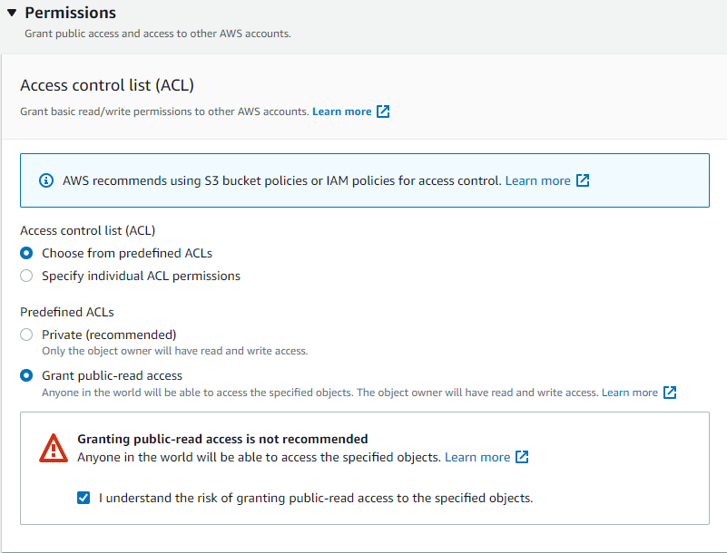
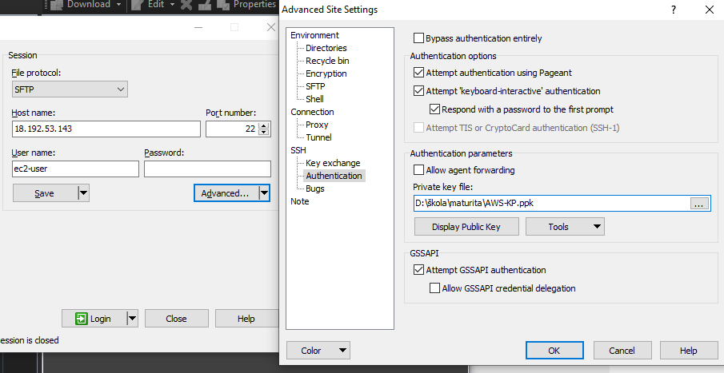

## Vytvořte a nahrajte statický web na AWS

### Statická webová stránka

Statická stránka se vyznačuje svou rychlostí načítání. Prohlížeč webovou stránku zobrazí přesně tak, jak byla navržena. Oproti dynamické webové stránce, která využívá databázi a podobně, je založena pouze na značkovém jazyku html, CSS, popřípadě doplněný programovacím jazykem Javascript.

Tyto stránky mají většinou příponu „.html“ a jsou dostupné na webovém serveru přes protokol HTTP.

Jedny z výhod jsou, jak už jsem zmínil, jejich rychlost, jelikož nenačítají nic z databáze. Obsah je na stránce a neklade žádné další zvláštní nároky na webový server. Její nevýhody jsou již na první pohled jasné, a to, že správa mnoha statický webových stránek může být dost těžká.

### Amazon S3

V tomto tutoriálu využijeme službu Amazon S3, která je aliasem pro Simple Storage Solution. Toto je nejvhodnější služba pro náš úkol a taky má příjemné uživatelské rozhraní.

V základní verzi nám dává možnost uložit až 100 objektů (souborů) do S3 Bucketu. Pro případné navýšení limitu se již musí platit. Dokáže uložit soubory až do velikosti 5 terabajtů. Soubory přes 160 GB lze nahrávat pouze přes AWS CLI, AWS SDK a Amazon S3 REST API. Na Amazon S3 můžete ukládat data v jakémkoliv formátu, ať už to jsou soubory typu: html, css, textové, javascript. 

Pyšní se svou stabilitou, zabezpečením a škálovatelností. Ve výchozím režimu aplikace pracuje v privátním režimu, pokud by se k ní chtěl tedy někdo dostat, nemá šanci. Jako u ostatních služeb se platí jen za to, co využijete. Při vytváření S3 Bucketu dostaneme v základu 3 availability zones v regionu, ve kterém ho vytvoříme. Tímto docílíme nižší latence a rychlý přístup k souborům, které na něj uložíme.

### Amazon S3 Bucket

Začneme se službou S3, kterou najdeme v kategorii Storage. Klikneme na „Create bucket“. „Bucket name“ musí být globálně unikátním názvem, takže nikdo na světe ho nesmí mít stejně pojmenovaný. Pro více informací navštivte: https://docs.aws.amazon.com/AmazonS3/latest/userguide/bucketnamingrules.html.
Já si ho pojmenuji „www.awstestpage.cz“. AWS Region je server, kde budeme hostovat náš server.

**Důležité!** „Block Public Access settings for this bucket“ nesmí být zaškrtlé, jelikož děláme statickou stránku a ta musí být veřejně přístupná, také k objektům budou mít přístup k objektům všichni uživatelé veřejně. Pokud by nebyla, uživatel by dostal chybovou hlášku. 

Bucket Versioning se stará o to, že budeme mít o jednu verzi souborů navíc, kterým přiřadí unikátní ID. Slouží jako záloha, pokud by se něco pokazilo. Například nahrajeme stejný soubor dvakrát, ale přepíšeme ho, tak AWS obnoví předchozí verzi souboru. V našem případě je funkce zbytečná.

Server access logging dokáže sledovat IP adresy ostatních uživatelů, kteří například dávají požadavek na určitý GET request.

Tags slouží, jako u vytváření instance Linuxu, k vytvoření skupiny za pomoci přiřazení štítku pomocí klíče.

Object-level logging a další jsou již placené služby. Je podobný k Server Access Logging, výhodou je jen, že dostanete více informací než u Server access logging. Využívá službu CloudTrail, za kterou bychom si museli připlatit. Naopak Server access logging využívá S3 delivery, který operuje pouze v S3 Bucketu.

Default encryption je k zašifrování souborů a Object lock přiřadí zámek k určitým souborům a nepůjdou smazat. Přeskočíme vše ostatní a dáme „Create bucket“.

Rozklikneme si náš bucket a dáme upload. Nahrajeme všechny potřebné soubory pro náš web. V rozhraní máme „add folder“ a „add files“ zvlášť. Po nahrání souborů a složek sjedeme dolů klikneme na „Permission“. Zde musí být vše veřejně dostupné, takže změníme možnost na „Grant public-read access“. Properties necháme na standartním, abychom neplatili. Poté klikneme na „Upload“.



Zde je odkaz na přehledný ceník na službu Amazon S3: https://aws.amazon.com/s3/pricing/

Po prohlédnutí informací zavřeme okno a přejdeme do „Properties“. Úplně dole je „Static website hosting“. Dáme „edit“ a „enabled“. Do políčka Index document napíšeme naši hlavní stránku, v mém případě „index.html“. Posledním krokem je „Save changes“. V „Properties“ dole máme Static website hosting a adresu k našemu S3 bucketu, ale ještě není dostupný všem na světě. Odkaz na moji statickou stránku (momentálně vypnuta, všimněte si oblasti, kde se nachází): http://www.awstestpage.cz.s3-website.eu-central-1.amazonaws.com/

Zde je odkaz na přehledný ceník na službu Amazon S3: https://aws.amazon.com/s3/pricing/

Po prohlédnutí informací zavřeme okno a přejdeme do „Properties“. Úplně dole je „Static website hosting“. Dáme „edit“ a „enabled“. Do políčka Index document napíšeme naši hlavní stránku, v mém případě „index.html“. Posledním krokem je „Save changes“. V „Properties“ dole máme Static website hosting a adresu k našemu S3 bucketu, ale ještě nemusí být všem přístupný. Odkaz na moji statickou stránku: http://www.awstestpage.cz.s3-website.eu-central-1.amazonaws.com/

### Statický web na EC2 instanci
V cloudech není jen jedno řešení jejich víc. K zprovoznění můžeme využít i EC2 službu, kde můžeme provozovat naši statickou stránku.
Vytvoříme si novou instanci Linux. Opět zvolíme  „Amazon Linux 2 AMI (HVM) - Kernel 5.10, SSD Volume Type.“ V „Choose Instance“ vybereme t2.micro free tier, v nastavení „Configure instance“ přejdeme úplně na konec stránky a do posledního textového pole vložíme následující skript. Ten nám aktualizuje instalační balíky, instaluje Apache server, zapne službu Apache.
```
#!/bin/bash
yum update -y
yum install httpd -y
systemctl start httpd
systemctl enable httpd
```


Klikneme na „Next:Add Storage,“ kde si navolíme kapacitu disku. Klikneme na „Next“ dvakrát a nakonfigurujeme „Configure Security Group“. Zde klikneme na „Select an existing security group“. Zvolíme si tu, co jsme poprvé zvolili. V mém případě se jmenuje „cloudnewbie“. Přeskočíme „review details“ a dáme launch. Zvolíme náš pár klíčů, který jsme si vytvořili u předchozí instance Linuxu a zafajfkujeme „I Aknowledge...“ Dalším problémem bude to, že instanci budeme využívat jako hosting pro náš statický web. Budeme muset změnit Protokol na http.


Než se nám instance EC2 nastaví a spustí, přejdeme do EC2 služby v „Network & Security“ máme „Security Groups“. V tomto nastavení nastavíme protokol http (80), abychom mohli provozovat náš web.

Vybereme skupinu, kterou jsme si již dříve vytvořili. V „Inbound rules“ máme po pravé straně „Edit inbound rules“. Zde přidáme pravidlo (Add rule) a v prvním políčku napíšeme http a následně vybereme Anywhere-IPv4. Přidáme stejné pravidlo pro IPv6 pokud ji budeme používat, ale nemusíme.


Jak můžeme vidět, tak máme celkem 3 protokoly, jeden máme pro IPv6 a druhý pro IPv4.


Přejdeme na naši instanci linuxu s http protokolem v „Instances“ a podíváme se na „Details“. Zde máme na výběr z DNS adresy, nebo IP, zvolte si, jakou se chcete připojovat. Ale musí být public.

Přejdeme na naši instanci a připojíme se přes PuTTY. V nastavení Auth zvolíme náš klíč a připojíme se pod názvem ve tvaru `ec2-user@naše public IPv4 adresa`. Můžeme si ověřit pomocí příkazu, že nám služba Apache běží.

`systemctl status httpd`


Nyní stáhneme nástroj Win SCP, který nám poslouží k napojení se na instanci linuxu. Odkaz ke stažení zde: https://winscp.net/eng/download.php.

Po stažení a nainstalování si spustíme program WinSCP. Připojíme se přes protokol SFTP na portu 22. Do „Host name“ kolonky vložíme naši adresu „veřejná IPv4 adresa instance linuxu“ a do kolonky „Username“ vložíme „ec2-user“. Dalším krokem je přidání našeho privátního klíče.


Klikneme na „Advanced“ dvakrát a v „Authentication“ si si vybereme náš privátní klíč, kterým přistupujeme k našemu virtuálnímu stroji. 



Pokud se nás na něco zeptá klikneme na „Yes“.
Rozhraní je vcelku jednoduché. Na levé straně vidíme lokální soubory počítače, na pravé naši instanci Linuxu. Poklepnutím dvakrát na modrou lištu levé strany se nám otevře nabídka, kde si s použitím tlačítka „browse“ vybereme složku, kde je náš web uložený a přetáhneme na druhou stranu. Složka s webem se nám uloží do domovského adresáře a je hotovo. Program můžeme ukončit.


Teď přejdeme do Linuxu a podíváme se na soubory ve složce za pomoci příkazu
cd „název složky“
Podíváme se na soubory a jejich práva.

`ls -l`

Přesune všechny soubory ze složky static website do složky /var/www/html, kde budeme náš server hostovat.

`mv * /var/www/html`


Už nám jen bude stačit zprovoznit náš web. Stačí napsat Public IPv4 adresu naší linuxové instance a máme web zprovozněný. Poté kdykoliv instanci můžeme vypnout.


Delší video, které popisuje jak vše funguje v AWS: https://www.youtube.com/watch?v=hiKPPy584Mg

Zde vysvětluje základní pojmy od začátku až po typy služeb (analytické, pro ukládání dat atd.), zkrácená verze (18 minut): Úvod do služeb AWS https://www.youtube.com/watch?v=B08iQQhXG1Y&t.

## Navigace:
  - [Cloudové služby obecně](Cloudove_sluzby_obecne.md)
  - [Amazon Web Services - Základní nastavení účtu](AWS_nastaveni.md)
  - [Virtuální stroj v AWS](AWS_navod_VM.md)
  - [Statický web v S3 Bucket](AWS_navod_static_website.md)
  - [Web postavený nad frameworkem v EC2](AWS_navod4_CI4_web.md)
  - [Návod zprovoznění CMS Wordpress](AWS_navod_wordpress.md)
  - [Dokumentace](docs/Dokumentace.doc)


