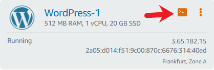
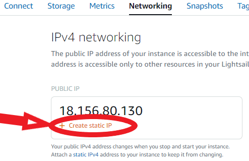
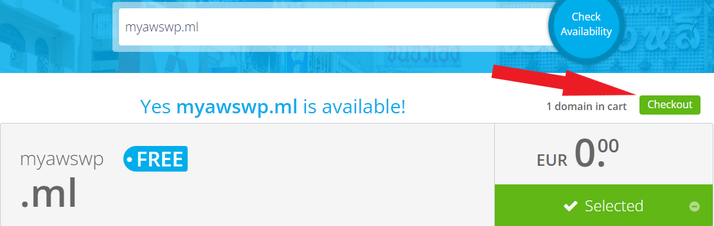
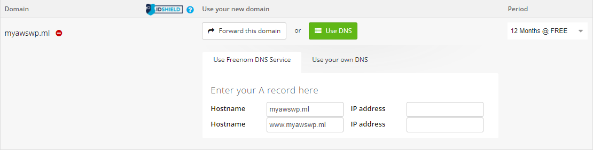
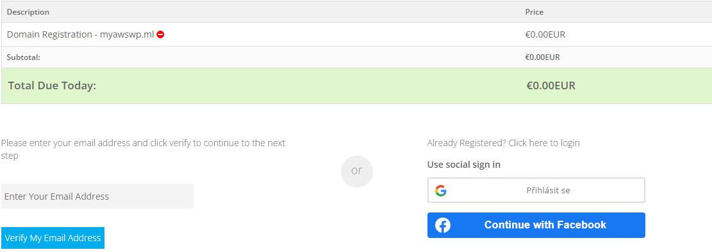
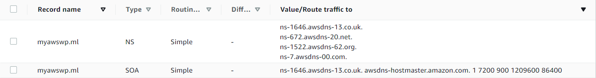
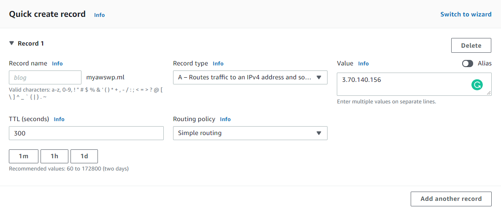
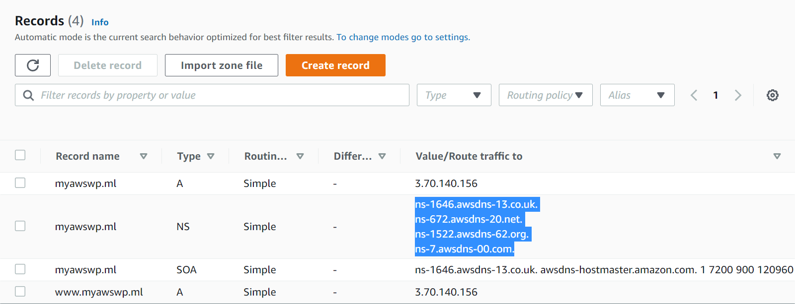
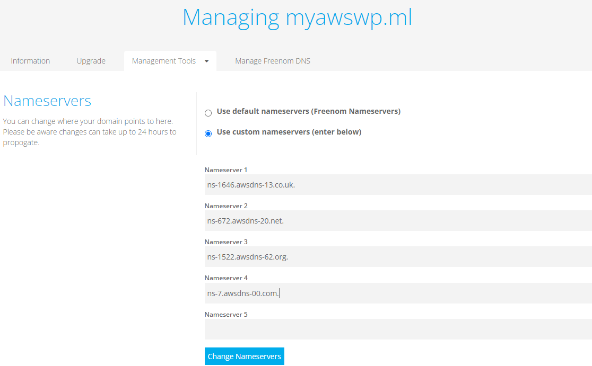
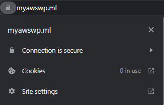

## Web založený na CMS Wordpressu

Wordpress je jeden ze systémů pro správu obsahu, který zajištujě webový obsah stránek, popřípadě doplňky jako jsou třeba pluginy.

Jedny z výhod CMS je například to, že osoba, která se stará o stránky nemusí být zdatná v programování. O pohodlnou správu stránek se dá postarat v administraci samotného CMS, což snižuje náklady. Člověk, který web vyvíjí nemusí začínat hned od nuly a může využít šablon.
 
### Lightsail
**Upozornění**
Lightsail je jedna z alternativních služeb, na které lze hostovat vlastní webovou aplikaci. Služba má vestavěný i vlastní firewall. 

**Je zdarma po dobu 3 měsíců a 750 hodin v provozu každý měsíc zdarma, poté si Amazon účtuje poplatky. Za nejnižší balíček (RAM, CPU, disk) $3,50 USD. Cena nemusí být aktuální.**

1. Do konzole napíšeme „Lightsail“ nebo ji můžeme najít na úvodní stránce konzole. 
2. Klikneme na „Create Instance.“ Zde se nás zeptá na region, ve kterém chceme mít naši aplikaci zprovozněnou. Pokud nemáme vybraný region, tak vybereme ten nejbližší. V konzoli jsem si již vybral „Frankfurt eu-central-1,“ jako mou nejbližší lokaci. Můžeme ale také zvolit lokaci, ze které očekáváme největší množství budoucích uživatelů našich stránek.
3. Necháme si předem zvolenou platformu instance „Linux/Unix“ a blueprint „Wordpress.“ SSH key můžeme nechat tak jak je. Připojovat se budeme jiným způsobem. 
4. „Instance plan“ ponecháme na výchozím. Poté se dá plán vybírat podle toho, jestli potřebujeme mít více místa na disku/výpočetní výkon atd..

„Enable automatic snapshots“ slouží k pravidelným zálohám serveru, které pro nás ale budou nepotřebné. Za tuto službu se platí $0.05 USD za gigabajt/měsíčně. V poslední kolonce si pojmenujeme instanci. Cena nemusí být aktuální.

Instanci potrvá přibližně  2 minuty, než se nám spustí. Poté můžeme kliknout na ikonku konzole.

Privátní IP adresa je dostupná pouze v rámci Lightsailu na Amazonu a Public IP adress veřejně.

Jak vidíme, máme k dispozici Ipv4 a Ipv6, která je veřejná. Takže hned si můžeme zkusit načíst naši stránku. První přejdeme do administrace wordpressu. Jako každý Wordpress web se do administrace dostaneme pomocí URL: „naše ip adresa/wp-admin.“  Username je vždy „user“ a heslo získáme z terminálu viz. obrázek.

Po spuštění napíšeme příkaz: `cat bitnami_application_password` Heslo nám slouží k přihlášení do administrace.

### Privátní IP adresa a routování DNS

Kapitola se vztahuje k problematice IP adresy a DNS. Co když chceme, abychom měli jednu IP adresu, přes kterou se uživatelé budou připojovat a po každém zapnutí serveru se neměnila?

V Amazon Lightsail se za privátní adresu neplatí tehdy, pokud ji využíváme čili je aktivní a přiřazená k instanci. **Pokud je instance nedostupná nebo je vypnutá, nebo není připojená k instanci, tak za ní platíme $0.005 USD** za každou započatou hodinu po první hodině. Veřejných IP adres, hlavně Ipv4 není moc a Amazon se snaží s nimi nakládat šetrně. Cena nemusí být aktuální.

V záložce „Networking“ naší vytvořené instance Lightsailu klikneme pod public IP na „Create static IP.„

Lokaci zvolíme tam, kde jsme vytvořili naši instanci. Ve druhém bodě si můžeme pojmenovat naši IP adresu podle potřeby. Po vytvoření nám vypíše public IP a instanci, pro kterou jsme zvolili statickou IP adresu. Klikneme na název instance a vše je hotovo.

### Doména webové stránky (přes DNS freenom.com) – tato část může být placená!

V první řadě chci upozornit, že tato část může být placená. V této části využijeme **public DNS třetí strany**, za kterou bychom za normálních okolností v Amazonu platily. Avšak Amazon si za routy a další účtuje taky. V tomto případě platí, že když smažeme routy do 12 hodin od vytvoření, nebude nás to stát vůbec nic. V opačném případě musíme platit, vyjde to v řádu pár korun.

Dalším krokem bude DNS server. Jelikož Amazon neposkytuje vlastní doménu zdarma, můžeme využít DNS servery zdarma. K tomu využijeme službu Route53 a web Freenom.

Freenom je web, který usnadňuje hledání pro alternativní DNS domény. Jedinou nevýhodou je, že budeme muset využít přípony jako .tk, .ml, .ga a další místo .cz, .com, .net.

DNS je protokol, který překládá adresy z čísel na čtivé a lehce zapamatovatelné názvy. Například Freeweb.cz a další.

Přejdeme na stránku https://www.freenom.com/en/index.html?lang=en, kde v navigaci přejdeme do „Services“ a „Register a New Domain.“ Zadáme doménu podle našeho výběru ve tvaru „nazev_webu.přípona“ např.: „myawswp.ml.“ Lze si vybrat ze čtyř přípon: .tk, .ml, .ga, .gq. dostupnost domény a pokud je dostupná, pokračujeme na „Checkout.“

Po kliknutí se nám zobrazí  menu kde si nastavíme „Period,“ tedy po jakou dobu bude doména aktivní. Limit je 1 rok pro účet zdarma. Hostname musí být s předponou „www“ i bez, aby mohl zadávat adresu i zkráceným způsobem. Do „IP address“ napíšeme naši statickou IP adresu.

Poté zadáme náš email v dolním rohu „Verify My Email Address“ a máme hotovo. Poté přijde ověřovací email, přes který se zaregistrujeme. Stačí vypnit jméno, příjmení, město, kraj a heslo.

Teď se podíváme do služby Route53 v konzoli. 	Na hlavní stránce služby klikneme na „Create hosted zone.“ V „Domain name“ napíšeme adresu, kterou jsme si na freenom vytvořili př. „myawswp.ml.“ a vytvoříme.

Nejdůležitější ze všech částí bude „Value/Route traffic to.“ Označuje servery přes které bude putovat, aby se připojil k naší veřejné doméně. NS znamená Name Server. TTL je time to live, říká, jak dlouho bude DNS záznam uchován v cache lokálního DNS serveru, je nejlepší mít toto číslo co nejnižší, necháme na 300.

Klikneme na Create record -> simple routing. „Record name“ necháme prázdné. Uděláme stejný krok, jen poprvé necháme Record name prázdné a podruhé přidáme „www.“ Do „Value“ vložíme naši statickou IP adresu nebo veřejnou IP adresu, IP adresy oddělujeme klávesou enter. 

***Doména webové stránky (přes DNS Amazonu)***

Můžeme také využít Amazon DNS server. Po přihlášení na freenom.com přejdeme v navigaci na Services -> My Domains -> Manage Domains ->Management Tools -> Nameservers. Zde vložíme naše 4 modře označené NS adresy z Route53. Změna se může projevit až za 15 minut.

### Zajištění SSL certifikátu (Lightsail)
Chceme-li mít naše připojení zabezpečené a šifrované využijeme SSL certifikátu, který zabezpečuje připojení mezi transportní a aplikační vrstvou. Místo adresy `http://www.myawswp.ml` budeme mít zabezpečenou adresu `https://www.myawswp.ml`, takže náš prohlížeč nebude hlásit, že je připojení nezabezpečené. U Lightsailu se dá SSL certifikát nastavit za pár momentů i tak to ale pár minut potrvá.

Zapneme naši instanci v Lightsailu klidně z našeho počítače, jelikož jsme nenastavovali SSH připojení přes Putty. Klikneme na „Connect using SSH.“ Linux se nám spustí v prohlžíeči v novém okně. Teď už jen stačí zadat následující příkaz, který nás poté provede nastavením.

1.	`sudo /opt/bitnami/bncert-tool`
2.	v Domain list napíšeme obě dvě adresy s „www“ i bez „www.“
3.	Enable http to HTTPS redirection dáme „y“
4.	Enable non-www to www redirection dáme „y“
5.	Enable ww to non-www redirection dáme „n“
6.	Do you agree to these changes? Dáme „y“
7.	E-mail address, kde zadáte svojí emailovou adresu.
8.	Do you agree to the Let’s Encrypt Subscriber Agreement? Dáme „y“
9.	Počkáme a jak bude vše dokončené, zmáčkneme Enter a napíšeme „exit“ pro odhlášení.

Toto jsou všechny kroky k tomu, abychom získaly SSL certifikát, který se nám bude automaticky obnovovat. Naše připojení nyní vypadá takto:

## Navigace:
  - [Cloudové služby obecně](Cloudove_sluzby_obecne.md)
  - [Amazon Web Services - Základní nastavení účtu](AWS_nastaveni.md)
  - [Virtuální stroj v AWS](AWS_navod_VM.md)
  - [Statický web v S3 Bucket](AWS_navod_static_website.md)
  - [Návod zprovoznění CMS Wordpress](AWS_navod_wordpress.md)
  - [Dokumentace](docs/Dokumentace.doc)