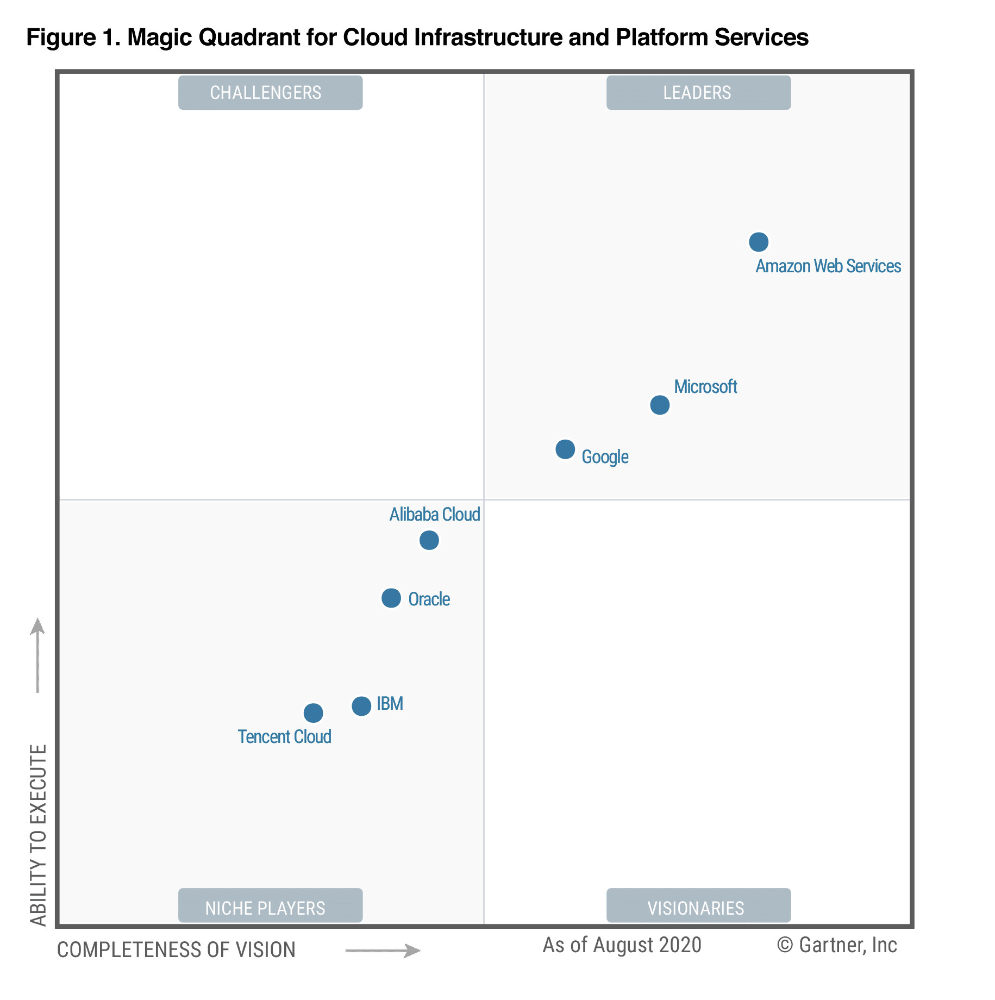
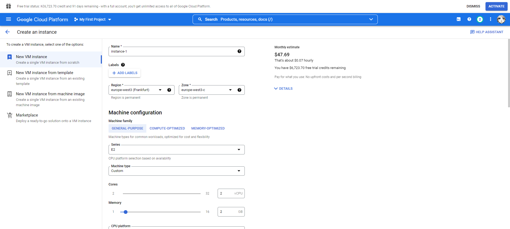
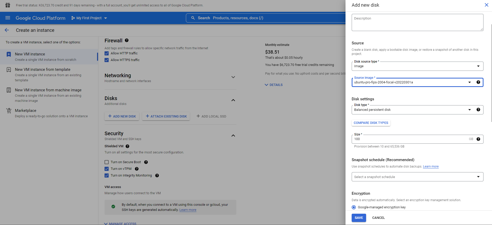
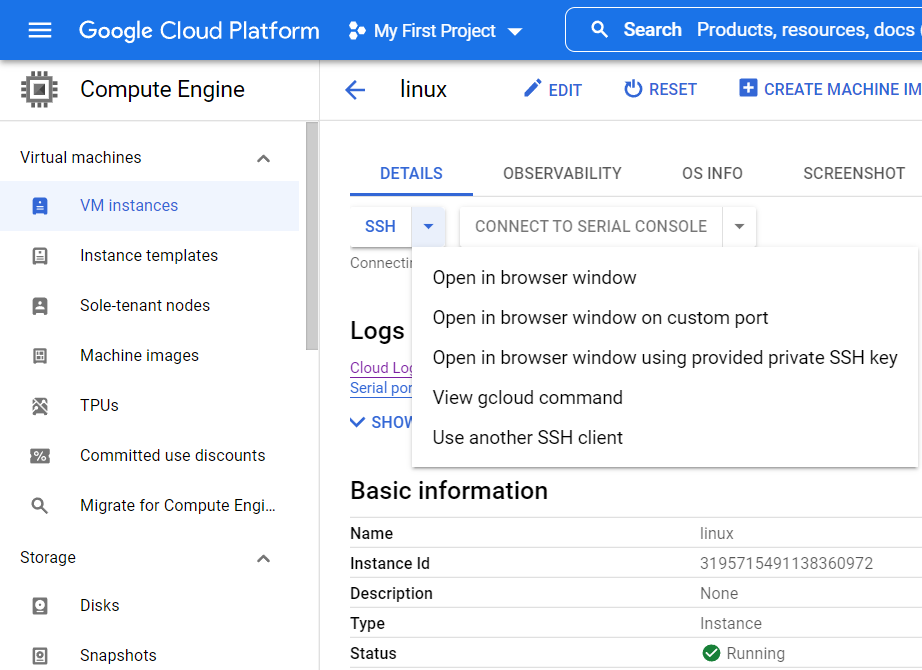
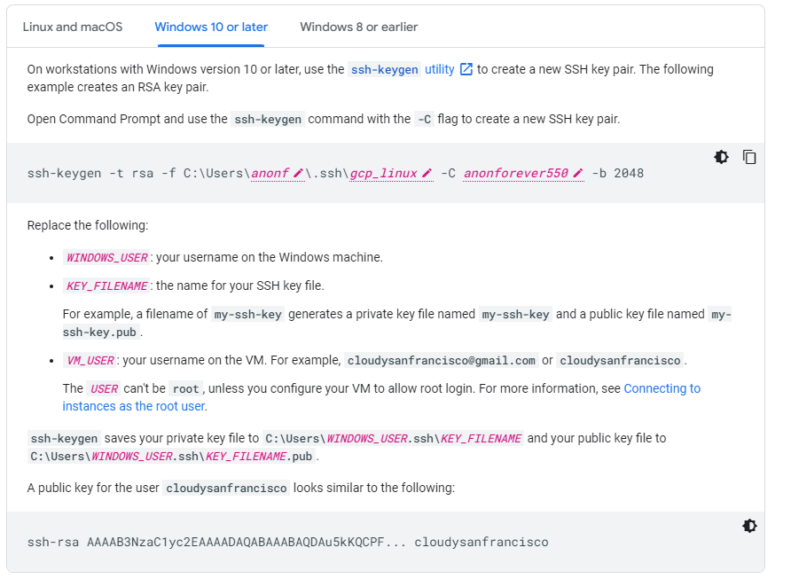
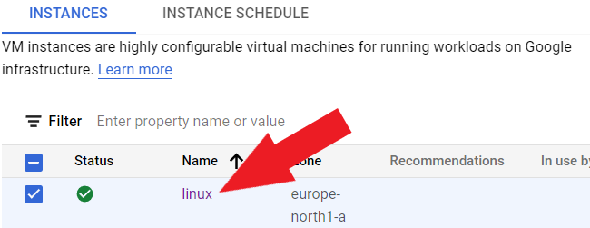
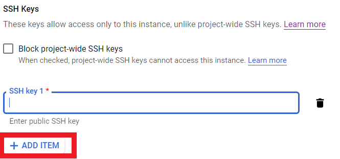
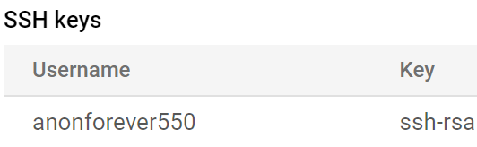
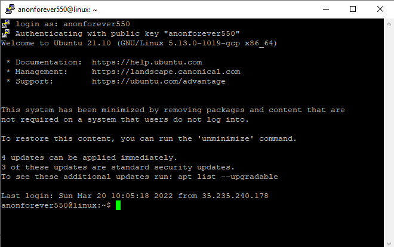

# Google Cloud Platform

- poprvé založeno v roce 2008
- využívá open-source služeb, které jsou navzájem propojené
- Google je 3. největší lídrem v cloudu jako IaaS (Infrastracture as Service)
- Jako druhý nejmladší z rodiny cloudů má 29 regionů, 88 zón viz. [aktuální rozmístění služeb](https://cloud.google.com/about/locations)

[Využité zdroje](https://www.youtube.com/watch?v=h8fhcmLHsEI)

[Obrázek - zdroj](https://kinsta.com/wp-content/uploads/2020/12/Gartner-Magic-Quadrant.png)

- Cloudy a jejich služby mají jiné názvy, Google ale udělal přehlednou tabulku, rozdíl mezi AWS a Google Cloud.

Zdroj obrázku: https://kinsta.com/blog/google-cloud-vs-aws/

Celá tabulka k dostání potom zde: https://cloud.google.com/free/docs/aws-azure-gcp-service-comparison

|Feature|Amazon EC2|Compute Engine|
|:---:|:---:|:---:|
|Virtual machines| Instances| Instances
|Machine Images| Amazon Machine Image|Image
|Temporary virtual machines| Spot instances| Preemptible VMs
|Firewall| Security groups| Compute Engine| firewall rules
|Automatic instance scaling| Auto Scaling| Compute Engine autoscaler
|Local attached disk| Ephemeral disk| Local SSD
|VM import	|Supported formats: RAW, OVA, VMDK, and VHD| Supported formats: RAW, OVA,    VMDK, and VHD|
|Deployment locality| Zonal| Zonal|

- Další rozdíly, které nejsou jen v terminologii názvů, jak už je mezi AWS, GCP a Microsoft Azure je také v **modelu placení**
- **sekundový model placení (per-second billing)**, zde máme jen malý rozdíl, ale mezi hodinou a sekundou je obrovský
  - **Příklad:** Pokud chceme škálovat čili zvýšit prostředky, které využíváme, musíme za virtuální stroj zaplatit za celou hodinu, což by nás mohlo vyjít v AWS draze, hlavně pokud stroj potřebujeme jen na pár minut.

## Výhody AWS vs Microsoft Azure vs Google Cloud (Přehled)

||AWS|Microsoft Azure|Google Cloud|
|:---|:---:|:---:|:---:|
|model placení|hodinový|minutový|sekundový|
|Podle rozšíření a cen|nejstarší na trhu s nejrozšířenějšími možnostmi - nejdražší|Nejmladší, ale má relativně nízké ceny + $200 kredit|nejnižší ceny na trhu, ale méně rozšířený než AWS a Azure + $300 kredit zdarma|
|Slevy - Virtual Machine|Rezerované instance za běhu(např. na 1, nebo 3 roky)|Rezervované instance (1-3 roky až 70% sleva)|Rezerované instance|

Google Cloud Platform více o slevách (Commited use discounts): https://cloud.google.com/compute/docs/instances/signing-up-committed-use-discounts

- Další slevy, které mohou tito tři lídři poskytnout u virtuálních strojů jsou i slevy, které se můžou vyšplhat až k 90%. Má to ale háček, instance můžou být smazány/jejich disky v případě, že poskytovatel potřebuje kapacitu pro prémiové služby. Více informací s kompletním přehledem na: https://www.youtube.com/watch?v=KkKcaFp0z1s
- Doporučuji zhlédnout, video obsahuje přehled hlavních bodů, včetně tzv. Responsibility modelu, co si zákazník musí hlídat sám a co za něj udělá cloud provider.

## Vytvoření Linuxové VM a statický web, web nad frameworkem CI4
- Důležitá informace na začátek: Narozdíl od AWS a Azure, musíte vypnout instance, jinak bude odebírat z vašeho kreditu $300
- Pro vytváření virtuálních strojů nám poslouží služba Compute Engine (v AWS EC2, Azure - Virtual Machine)

- Google zde vsází na jednoduchost, lze i libovolně a intuitivně měnit počet jader CPU a další.
- Stejně jak u Microsoftu zde máte přehled ceny, která se bude měsíčně strhávat

- Výběr disku

- připojení přes SSH za pomoci malého tlačítka:

- Připojení zde se provádí jinak, než u Azure a AWS, který dá klíč hned po vytvoření. 
1. Musíme nejprve vygenerovat pár klíčů, zde: https://cloud.google.com/compute/docs/connect/create-ssh-keys#windows-10-or-later
- příkaz poté vložíme do příkazového řádku, ukázka příkazu (lze přímo upravovat na stránce):

Druhou možností je využít PuTTYgen key generator, kliknout na generate a v kolonce `Key comment` zadat své jméno. Potom zkopírovat Public key.

### Povolení SSH připojení
Pokud jsme již dřívě neprovedli, musíme povolit připojení ve Firewall.

![]

### Přidávání klíče
Zde už je to velice jednoduché. Přejdeme do detailů našeho stroje:

kliknemena edit:

- Sjedeme dolů a najdeme kategorii SSH keys a klikneme na Add Item, zde vložíme náš text klíče.
- zde vložíme klíč z `.pub` formátu, stačí otevřít v textovém editoru.

- Poté stačí postupovat jak v mém návodu v AWS, kde mám PuTTY (připojení přes puTTY a přidání klíče do PuTTY)
- K připojení použijte pouze IP adresu, nezadávejte adesu ve tvaru `užviatelské_jméno@IP_adresa_serveru`, ale zadejte ve tvaru `IP_adresa_serveru`. Z neznámého důvodu nebere přes PuTTY uživatelské jméno.

## Navigace:
  - [Cloudové služby obecně](Cloudove_sluzby_obecne.md)
  - [Amazon Web Services - Základní nastavení účtu](AWS_nastaveni.md)
  - [Virtuální stroj v AWS](AWS_navod_VM.md)
  - [Statický web v S3 Bucket](AWS_navod_static_website.md)
  - [Web postavený nad frameworkem v EC2](AWS_navod4_CI4_web.md)
  - [Návod zprovoznění CMS Wordpress](AWS_navod_wordpress.md)
  - [Dokumentace](docs/Dokumentace.doc)