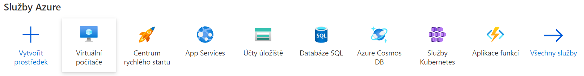
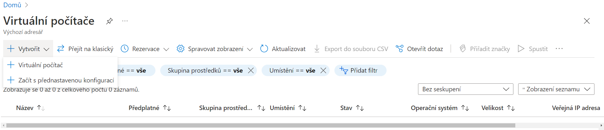
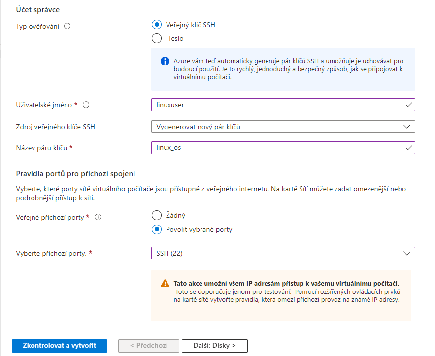
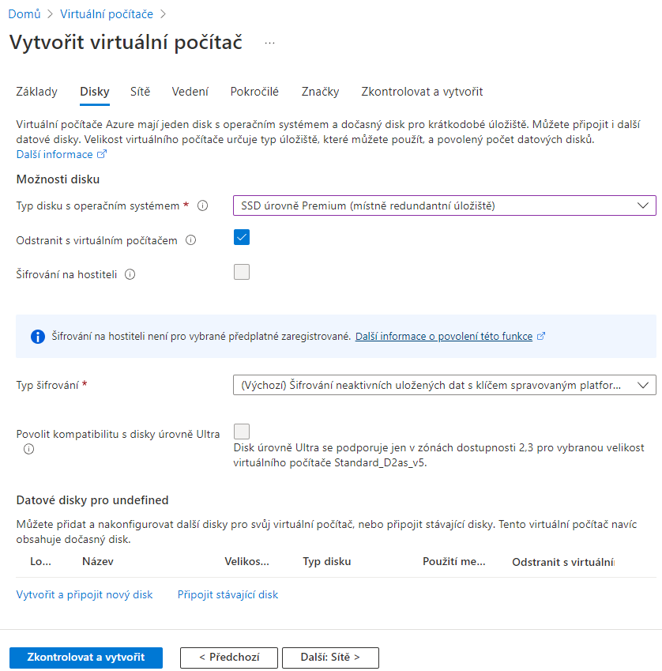
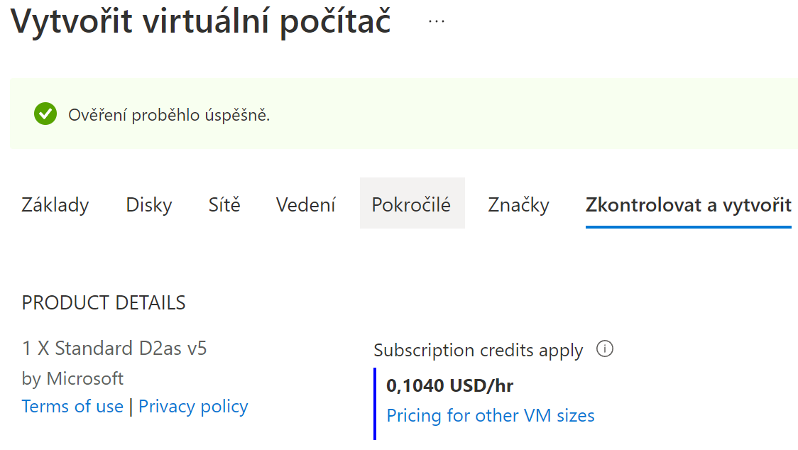
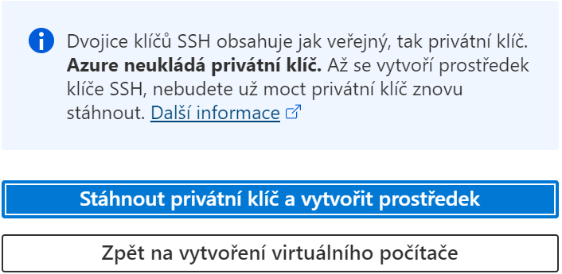
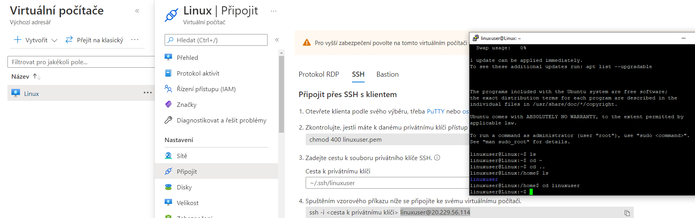
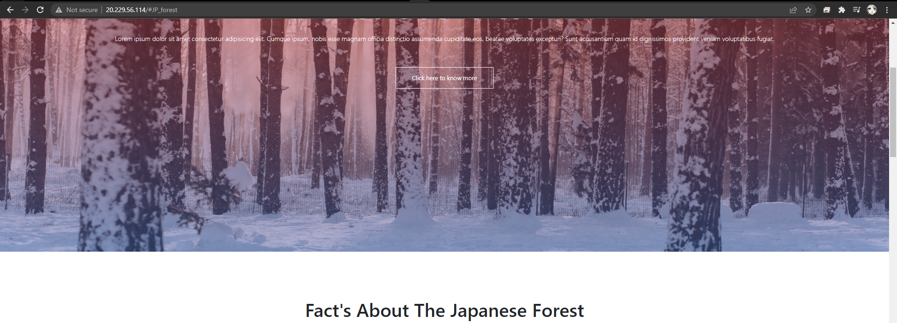

# Microsoft Azure
[zdroj 1](https://www.youtube.com/watch?v=9kcyEiTkC2E)
- Stejné výhody jako u Amazonu (12 měsíců nejvyužívanějších služeb zdarma)
- Zahájení v roce 2010
- Datacentra ve více než 42 zemích světa
- Odkaz na trial verzi služeb a jejich limity: [Klikněte zde](https://portal.azure.com/?quickstart=true#blade/Microsoft_Azure_Billing/FreeServicesBlade)
- Podle statistik a podílu na trhu se jedná o druhou největší platformu hned po Amazon Web Services.

Klíčové rozdíly oproti Amazon Web Services ([zdroj 2](https://www.educba.com/aws-vs-azure/)):
- AWS i Azure využívají stejné modely, avšak Azure si účtuje za miutu, čož poskytuje přesnější cenový model
- U AWS EC2 si uživatelé mohou vybrat vlastní předkonfigurovaný obraz systému, u AWS si nejprve musí uživatelé vybrat disk nakonfigurovaný třetí stranou
- výběr z různých úrovní zabezpečení a integraci Microsoft programů

## Klíčové rozdíly mezi Amazon Web Services a Microsoft Azure

|Amazon Web Services|Microsoft Azure|
|:---:|:---:|
|Výběr z populárních služeb na 12 měsíců zdarma| Výběr z populárních služeb na 12 měsíců zdarma + kredit 200 USD pro vyzkoušení placených služeb|
|Účtovaní v modelu za hodinu (méně přesné)| Účtování v modelu za minuty (přesnější)|
|AWS je více uzavřený hybridním řešením|Azure je otevřený hybridním cloudovým řešením|

## Rozdíly dle využitých služeb

|AWS|Microsoft Azure|
|:---:|:---:|
|EC2 - výběr z předkonfigurovaných image systému| Virtual Machine pod kategorií Compute|
|Bucket S3 - úložiště objektů + pro VM dočasné úložiště| block storage|

- Podrobný seznam služeb a většiny rozdílů najdete přehledně na https://www.guru99.com/azure-vs-aws.html.

## Vytvoření Linuxové VM a statický web, web nad frameworkem CI4

- [zdroj 3](https://www.youtube.com/watch?v=iUaTq06m26g)

- V základním panelu Azure máme přehledně vypsané služby. Klikneme na Virtuální počítače.

- Stejně jak v AWS zde mám i možnost vytvořit VM komunitní přednastavený OS

V základech u Azuru se nastavují věci stejně jak v AWS:
1. Předplatné (na začátku získáte $200 pro placené služby, automaticky brané)
2. Skupina prostředků - vytvořit (pod tímto jménem se shrnují všechny HW prostředky pro VM)
3. Název VM
4. Oblast neboli region, kde se bude nacházet instance např. West Europe (má nárok na využití bezplatného premium - startovací kredit $200)
5. Možnosti dostupnosti - Tomuto tématu jsem se nevěnoval, ale jde o to, že cloud je škálovatelný, z čehož plyne výhoda zprostředkovávat efektivně přiřarovat prostředky na další rozšíření serverů. např. napříč zónami. Kdyby jeden server zkolaboval, nahradil by ho druhý atd. Toto jsou pokročilé nástroje.
6. Typ zabezpečení virtuálního stroje (AWS taky má autoamtickou ochranu, jen tady se dá nastavit)
7. Obrázek (Image) - OS virtuálního stroje
8. Instance Azure Sport (zařízení instance s dočasným diskem v rámci nevyužitých zdrojů Azure. Je to levnější varianta s rizikem smazání disku Azurem)
9. Velikost - Zde je to složité, jelikož Azure nemá tlačítko Free Tier, nebo podobnou funkci. Vlastně vybíráme, jaké parametry (RAM, jader v CPU atd.) bude naše instance mít. Pro **West Europe**, z nejlevnějších variant **D2as_v5** z **D-Seres v5**. V rámci předplatného s kreditem $200 se nemusíme bát, že bychom o něco přišli.

10. Zde už není co řešit. Vytvoření párů klíčů pro přístup a povolené příchozí porty k instanci.

**VM kategorie disky**

- Zde lze toho nastavit asi stejně tolik jak v AWS, zde ale lze rovnou naklonovat všechny disky na všechny zóny, my jsme ale žádnou hlavní nedefinovali a navíc máme jen jednu VM.
- Je zde také možnost šifrování, která nebude potřeba.
- Popřípadě lze přidat další disky při vytváření VM.

**VM kategorie sítě**
- nastavení IP adresy instance, statická a dynamická

**VM kategorie vedení**
- diagnostika, Azure AD (správa ostatních začízení běžících na Windows Server, Linuxových atd.), záloha, aktualizace OS, auto vypnutí

**VM kategorie pokročilé**
- předpřipravené příkazy, které se zahájí ihned po spuštění stroje

**VM kategorie značky**
- Tags, označení strojů, pokud jich máme víc, nebo řazení do kategorií

- V souhrnu vidíme vše co jsme nastavili i cenu za hodinu, jak zde vidíme.
- 

**Pkud chcete zkusit Azure, nezapomeňte na klíč, pak už ho nebudete moci stáhnout, stejně jak u AWS!!**

- defaultně nemusíme přiřazovat a vytvářet roli k virtuálnímu stroji v Microsoft Azure. Autmaticky se přiřadí role **vlastníka**
- Pokud chceme, můžeme jít do přehledu virtuálních počítačů a jít do řízení přístupu, také IAM (stejné jak v AWS).
- Připojení: Zde nabízí Microsoft připojení přes SSH protokol, RDP (Remote Desktop Protocol na TCP portu 3389) a Bastion, který slouží k bezpečnému připojení přes prohlížeč.

- Dalším rozdílem, na který jsem narazil je, že **veřejná IP** se považuje za přiřazený prostředek čili se chová trochu jak elastická IP adresa u AWS. Když vypnu počítač, zůstává stejná, **nemění se.**

- instalace php + mysql (přes xampp): [mysql](https://agaetis.tech/development/how-to-install-linux-server-for-php-and-mysql/), [php verze 8](https://www.howtoforge.com/how-to-install-php-8-on-debian-11/)
- Nesmíme zapomenout vytvořit databázi se stejným názvem, pokud budeme nahrátvat web nad frameworkem.
- A výsledek? Není zde co řešit, frameworkový web lze stejným způsobem udělat.

instalace xampp: [Xampp instalace](AWS_navod4_CI4_web.md)

https://computingforgeeks.com/how-to-install-php-on-ubuntu-2/

MYSQL: https://www.digitalocean.com/community/tutorials/how-to-import-and-export-databases-in-mysql-or-mariadb

### Instalace Wordpressu na službu Web App

